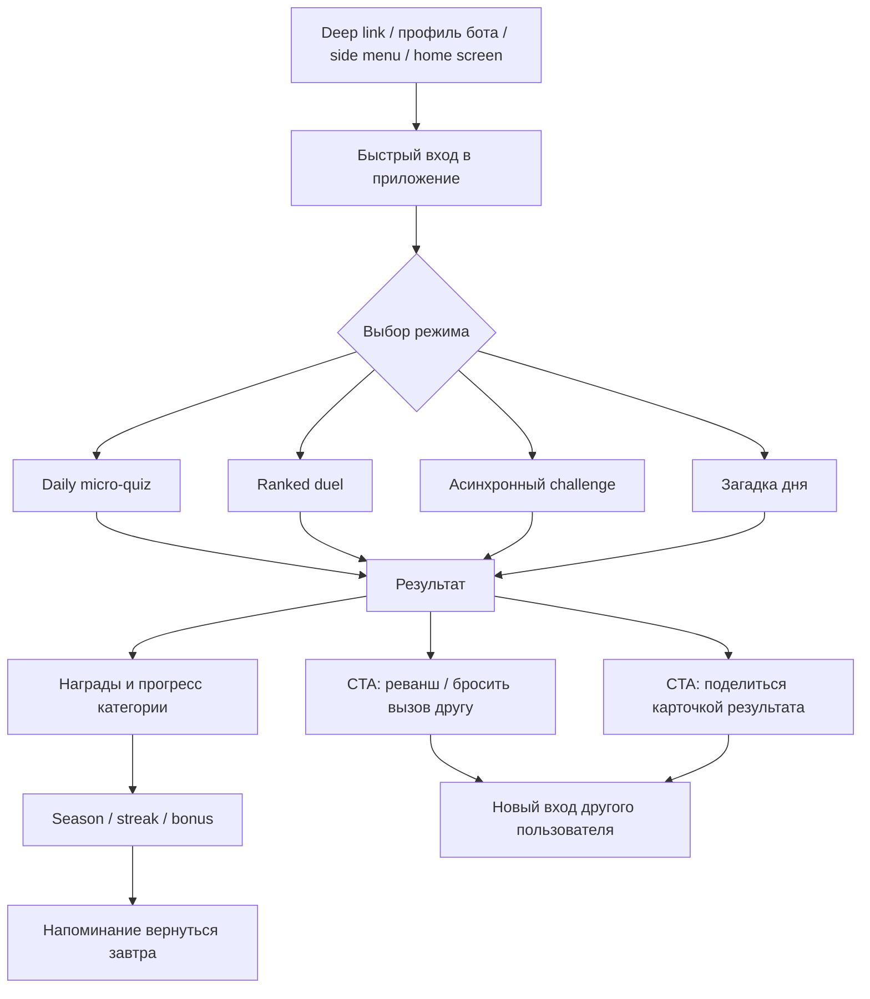
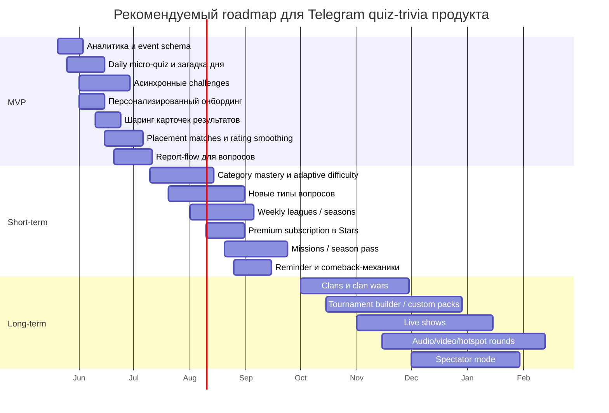

# Глубокий анализ Telegram quiz-trivia продукта

## Резюме для руководителя

По приложенному скриншоту видно, что у вашего продукта уже есть сильный «каркас» trivia-игры: рейтинговый слой с IQ-оценкой, категории, ежедневные механики, бонусы, лидерборды, профиль и социальный вызов через матчмейкинг. Это хорошая стартовая позиция: вы уже не «просто викторина», а зачаток соревновательной сервисной игры. Но сейчас продукт, вероятнее всего, слишком сильно опирается на один главный сценарий — «зайти и сыграть матч/квиз». Для роста удержания и охвата обычно нужны минимум три параллельные петли: быстрый solo-режим без давления, социальный асинхронный вызов друзьям и сезонный мета-прогресс с долгим горизонтом. Именно это отличает устойчивые trivia-продукты от одноразовых квизов. Такой вывод хорошо согласуется с практиками рынка: Telegram поддерживает полноценные Mini Apps с полноэкранным режимом, deep links, шарингом в чаты и сторис, домашними ярлыками, push-сценариями, платежами в Stars и платными подписками; при этом более 500 млн пользователей Telegram уже взаимодействуют с mini apps ежемесячно. citeturn15view0turn2view1turn2view2turn2view3turn2view4

Наиболее выгодная стратегия для вашего класса продукта — не пытаться сразу стать «всем для всех», а построить многослойный trivia-loop вокруг уже существующего ядра. Практически это означает: оставить рейтинговый режим как aspirational-слой, но быстро добавить асинхронные дуэли, ежедневные микроквизы, систему освоения категорий, шаринг результатов/вызовов в Telegram и мягкую персонализацию с первого сеанса. Такой набор обычно даёт лучший баланс между влиянием на удержание и стоимостью реализации, чем дорогие live-show форматы, кланы с внутренним чатом или heavy UGC. Рынок это подтверждает косвенно: Trivia Crack 2 комбинирует 1v1, daily challenge, уровни и команды; Kahoot сочетает live и self-paced сценарии с разными типами вопросов; Sporcle держит вовлечение через бейджи, плейлисты, streaks, турниры и расширенную статистику; JetPunk — через многоформатный user/content layer, бейджи, уровни и daily challenge. citeturn10view1turn10view3turn20view4turn32view0turn32view1turn32view2turn32view3turn30view0turn30view2turn30view3

Самый важный вывод по приоритетам такой: **в MVP и ближайшей итерации надо инвестировать не в самые «громкие» функции, а в самые «липкие»**. Это, в первую очередь, быстрые ежедневные сценарии, асинхронные вызовы, качественная калибровка сложности и рейтинга, видимый прогресс по категориям, хорошая аналитика и аккуратная платёжная архитектура в Telegram Stars. Платформа Telegram для этого уже даёт сильные рычаги: встроенные Stars для цифровых товаров, подписки, affiliate/referral-механику, прямые ссылки, шаринг и продвижение mini app внутри экосистемы. citeturn26search0turn2view2turn2view3turn2view4turn33view2

Если говорить совсем жёстко: **ваш лучший путь — построить “ranked trivia service”, а не просто “ещё одну викторину”**. Для этого в краткосрочном горизонте стоит делать ставку на асинхронные PvP, daily-micro content, category mastery, social share loops и сезонную экономику, а live-шоу, аудио/видео и creator-platform переносить в долгий горизонт. Это даст лучший шанс поднять D1/D7, удержать разные сегменты игроков и позже монетизировать без разрушения core-опыта. Внешний контекст тоже за это: официальный Telegram позиционирует Mini Apps как полноценную HTML5-платформу с авторизацией, платежами и tailored push notifications, а индустриальные mobile gaming-бенчмарки показывают, что удержание, ранняя активация и гибридная монетизация остаются главными драйверами жизнеспособности игры. citeturn15view0turn13view6turn13view5turn13view4

## Что видно по текущему продукту и что это значит стратегически

По скриншоту видно, что у вас уже есть почти все элементы базовой meta-оболочки: домашний экран с заметной игровой идентичностью, рейтинг, daily-блок, бонусы, отдельные категории, лидерборды, профиль и экраны вызова/сражения. Это означает, что ваш продукт уже находится не в плоскости «контентного бота», а в плоскости «игрового сервиса». Слабое место при такой архитектуре обычно одно и то же: если основной сценарий слишком соревновательный, часть аудитории отпадает до того, как сформирует привычку. Сильные игроки любят рейтинг, слабые — повторяемые безопасные победы. Значит, им нужен отдельный спокойный вход: ежедневный микроквиз, «разминка дня», режим тренировки категории, загадка дня, серия из 3–5 вопросов без риска потери рейтинга.

Отдельно важно переосмыслить ваш **IQ-рейтинг**. С маркетинговой точки зрения это сильный термин: он сразу обещает интеллектуальную соревновательность. Но с продуктовой и репутационной точки зрения его лучше трактовать как **игровой skill-score**, а не как реальный психометрический IQ. Психологическое тестирование и IQ-оценка в строгом смысле опираются на стандартизированные процедуры, нормы, валидность и контроль условий прохождения; обычная mobile/Telegram quiz-игра под эти условия не подпадает. Поэтому лучшая практика — сохранить внешний бренд «IQ», но внутри системы вести нормальный матчмейкинг- или skill-рейтинг, а в интерфейсе явно объяснить, что это игровой показатель знания/скорости/точности. citeturn25search2turn25search22

Стратегически это приводит к очень простой рамке. Ваш продукт должен одновременно обслуживать три мотива:
1. **самодоказательство** — рейтинг, лидерборд, длинные винстрики;
2. **ежедневную привычку** — микроформаты, бонусы, загадка/вопрос дня;
3. **социальное распространение** — вызов друга, пересылка результата, общий weekly-context в чате/группе.

Если одна из этих трёх опор отсутствует, рост обычно упирается либо в churn, либо в вялый virality loop. Telegram здесь особенно благоприятен: mini apps можно открывать как main app, из side menu, по direct link, из inline-сценариев; есть fullscreen, home-screen shortcuts, mini app previews, шаринг медиа в чаты и сторис, а также deep link-механики и групповой контекст для совместного использования. citeturn15view0turn2view1

## Полная карта форматов викторин и игровых механик

### Форматы сессий и игровых режимов

Ниже — практическая карта всех действительно полезных форматов для trivia-продукта. Таблица не опирается на «модность», а на то, какую работу формат делает для удержания, ширины аудитории и монетизации.

| Формат | Что чувствует игрок | Для чего нужен продукту | Вовлечение | Стоимость реализации | Риск/сложность | Рекомендация |
|---|---|---|---|---|---|---|
| Быстрый solo-спринт на 3–7 вопросов | «Зашёл на минуту и не облажался» | D1, D7, привычка, safe entry | Высокое | Низкая | Низкая | Обязательно |
| Endless/серия без ошибок | «Проверю свой потолок» | session length, mastery | Среднее-высокое | Низкая | Низкая | Да |
| Асинхронная дуэль 1v1 | «Кинул вызов — друг ответит позже» | вирусность, P2P-реферал, reactivation | Очень высокое | Средняя | Средняя | Обязательно |
| Синхронная ranked-дуэль | «Пот, риск, статус» | aspirational-слой, ARPDAU через core users | Высокое | Средняя | Средняя-высокая | Оставить и улучшать |
| Daily challenge | «Не хочу терять серию» | привычка, старты дня | Очень высокое | Низкая | Низкая | Обязательно |
| Загадка/вопрос дня | «Сегодняшний эксклюзив» | контентный ритуал, share-worthiness | Высокое | Низкая | Низкая | Обязательно |
| Микроквизы по категориям | «Прокачаю только историю/кино» | category loyalty, personalization | Высокое | Низкая | Низкая | Обязательно |
| Survival / knockout | «Ошибся — вылетел» | эмоция, spectator-value | Среднее | Средняя | Средняя | Позже |
| Team battle / clan war | «Мы против них» | социальная сцепка, долгий retention | Очень высокое | Высокая | Высокая | После product-market fit |
| Live show по расписанию | «Все играют одновременно» | event-based peaks, PR | Потенциально очень высокое | Высокая | Очень высокая | Только в long-term |
| Турнир/лига недели | «Хочу выше в еженедельной таблице» | midsession return, seasonality | Высокое | Средняя | Средняя | Да, short-term |
| Creator challenge | «Сделаю свой набор и брошу друзьям» | supply-side growth, UGC | Высокое | Высокая | Очень высокая из-за модерации | Не в MVP |

Практика рынка подтверждает, что именно сочетание нескольких режимов повышает глубину продукта. Telegram Quiz Bot изначально дал multi-question quiz, таймеры, private/group sharing и global leaderboard; в 2026 Telegram расширил poll/quiz слой медиа-вложениями, геопозицией, пользовательскими вариантами ответов, несколькими правильными ответами и новыми настройками сроков/результатов голосования. Trivia Crack 2 строит игру вокруг classic 1v1, tower duel, daily challenge, команд и чата. Kahoot сочетает live-игру и self-paced challenges. Sporcle выделяет отдельный social party app с team-based competitions и real-time scoring. citeturn22view0turn21view3turn10view1turn10view3turn32view1

### Типы вопросов

На уровне контента стоит мыслить не «у нас есть викторина», а «у нас есть движок интеллектуальных взаимодействий». Чем шире палитра типов вопросов, тем лучше вы обслуживаете разные категории и лучше контролируете усталость игрока.

| Тип вопроса | Ценность | Где особенно силён | Стоимость | Риск | Когда вводить |
|---|---|---|---|---|---|
| Один правильный вариант | Максимально понятный базис | общий trivia, ranked | Низкая | Низкий | Уже должен быть ядром |
| Несколько правильных вариантов | Уменьшает угадайку, повышает глубину | история, наука, факты | Низкая-средняя | Средний UX-риск | Short-term |
| True/False | Сверхбыстрый темп | micro-quiz, onboarding | Низкая | Угадывание 50/50 | Short-term |
| Порядок / puzzle | Даёт «руками подумать» | chronology, processes | Средняя | Выше нагрузка на UX | Short-term |
| Ввод текста | Сильно повышает чувство компетентности | столицы, персонажи, термины | Средняя | Фаззи-матчинг, опечатки | Short-term |
| Числовой slider | Хорош для прикидки | экономика, даты, расстояния | Средняя | Нужно аккуратно считать диапазоны | Позже |
| Pin/hotspot на картинке | Очень зрелищно | география, анатомия, логотипы | Средняя-высокая | Mobile UX и preload | Позже |
| Изображение как стимул | Разрушает однообразие | кино, мемы, бренды | Средняя | авторские права/качество | Short-term |
| Аудиовопрос | Богатый вау-эффект | музыка, языки, звуки | Высокая | preload, кроссплатформа, доступность | Long-term |
| Видеофрагмент | Максимальный wow, но дорогой | кино, спорт, шоу | Очень высокая | сеть, права, anti-cheat | Long-term |
| Fill-in-the-blank | Хороший middle ground | обучение и повторение | Средняя | локализация/нормализация | Позже |
| Matching / соответствия | Полезно для мета-знаний | обучение, языки, пары понятий | Средняя | сложнее mobile UX | Позже |
| Карта / click quiz | Очень сильна для geography | карты, территории | Средняя-высокая | подготовка ассетов | Позже |
| Логическая загадка | Увеличивает ценность «умной игры» | daily riddle, special events | Низкая-средняя | дорогой editorial QC | Обязательно как daily-feature |

Рынок уже валидировал почти весь этот набор. Kahoot официально поддерживает classic quiz, true/false, multi-select, puzzle, type answer, slider, pin answer, poll и open-ended formats. Sporcle использует multiple choice, maps, crosswords, clickable, fill in the blank и др. JetPunk даёт click quiz, map quiz, multiple choice, picture quiz, sudden death, text quiz и tile select. Telegram в 2026 добавил для опросов и викторин медиа, описания, пользовательские варианты, несколько правильных ответов и другие настройки, а Quiz Bot давно позволяет прикладывать текст и медиа перед вопросом. citeturn20view4turn10view5turn30view0turn30view1turn21view3turn22view0

### Что показывают конкуренты

| Продукт | Тип продукта | Ключевые форматы | Социальный слой | Прогрессия | Монетизация | Главный урок |
|---|---|---|---|---|---|---|
| Telegram Quiz Bot | Telegram bot | multi-question quiz, timer, private/group share | шаринг в группы/каналы, глобальный leaderboard | время + счёт | утилитарный, без выраженной game economy | Telegram-native квизы живут за счёт простоты распространения citeturn22view0turn20view5turn20view6 |
| Trivia Crack / Trivia Crack 2 | mobile trivia game | 1v1, daily challenge, tower duel, live challenges | friends, teams, chat | уровни, win streak, коллекции, own episodes | ads, premium/no ads, IAP | consumer trivia выигрывает, когда есть и PvP, и daily-loop, и social/team-layer citeturn10view1turn20view2turn20view1turn19search5 |
| Kahoot | live/self-paced quiz platform | live join-by-PIN, self-paced challenges, множество типов вопросов | shared screen, collaboration | progress tracking, courses, identifiers | подписки, тарифные планы | для высокой частоты хорошо работают разные форматы одного и того же контента citeturn10view3turn20view4turn20view3 |
| Wayground / Quizizz | quiz-learning platform | dozens of formats, AI adaptation, flashcards/timelines | class/group workflows | clear data and progress | SaaS/plans | персонализация и адаптация контента повышают устойчивость использования citeturn10view4 |
| Sporcle | web/mobile quiz ecosystem | thousands of quizzes, daily new quizzes, party mode, tournaments | friends, tournaments, party, real-time scoring | badges, playlists, streaks, stats | free + Sporcle Orange | глубину дают не только вопросы, но и мета-слой: streaks, badges, stats, tournaments citeturn32view0turn32view1turn32view2turn32view3turn20view0 |
| JetPunk | web quiz ecosystem | click/map/picture/text/MCQ/sudden death | account, ranks, stats | badges, levels, daily challenge | ads + premium | long-tail контент и много типов заданий продлевают жизнь продукта сильнее, чем одна «идеальная» mechanic citeturn30view0turn30view1turn30view2turn30view3 |

## Приоритет функций по влиянию и стоимости

Ниже — не «список желаний», а именно **приоритизированный backlog** для trivia-игры в Telegram. Оценка даётся по двум осям: влияние на метрики и относительная стоимость реализации.

| Функция | Зачем нужна | Влияние | Стоимость | Приоритет | Главный KPI |
|---|---|---:|---:|---|---|
| Асинхронные дуэли и rematch-links | превращают любой результат в новый вход | Очень высокое | Средняя | P1 | share-to-challenge rate, reactivation D3/D7 |
| Daily micro-quiz и загадка дня | создают ежедневный ритуал | Очень высокое | Низкая | P1 | daily participation, streak continuity |
| Category mastery + уровни по темам | удерживают не только «топов», но и обычных игроков | Очень высокое | Средняя | P1 | category repeat rate, 7-day depth |
| Онбординг с выбором любимых тем и уровня | быстрее доводит до первого «своего» опыта | Очень высокое | Низкая | P1 | activation, first-session completion |
| Шаринг result-cards в чат/сторис | бесплатная дистрибуция внутри Telegram | Высокое | Низкая | P1 | invites per DAU, viral K-factor proxy |
| Placement matches / мягкая калибровка рейтинга | снижает фрустрацию новичка | Высокое | Средняя | P1 | new-user win rate, first-week retention |
| Система качества вопросов и report-flow | защищает доверие к продукту | Высокое | Средняя | P1 | reported question rate, content churn |
| Write-access reminders и comeback-квесты | возвращают пользователя не спамом, а поводом | Высокое | Низкая-средняя | P1 | reminder open-to-play, resurrected users |
| Доп. типы вопросов: multi-select, order, image | убирают однообразие | Высокое | Средняя | P2 | session length, mode diversity |
| Weekly league / seasonal ladder | создаёт среднесрочный горизонт | Высокое | Средняя | P2 | WAU/MAU, season participation |
| Premium subscription + cosmetics | аккуратная монетизация без pay-to-win | Среднее-высокое | Средняя | P2 | pay conversion, subscription retention |
| Light friends/clans | усиливают рутину и social accountability | Среднее-высокое | Средняя-высокая | P2 | social DAU share |
| Season pass / mission board | растягивает контент на недели | Среднее-высокое | Средняя | P2 | mission completion, D30 |
| Creator tools для custom quiz packs | даёт supply-side growth | Среднее | Высокая | P3 | UGC creation rate |
| Live shows по расписанию | PR, peaks, events | Среднее | Очень высокая | P3 | concurrence, event DAU |
| Audio/video rounds | wow-эффект | Среднее | Высокая | P3 | completion by media type |
| Spectator mode / clan wars | социальный статусный слой | Среднее | Высокая | P3 | spectate sessions, clan retention |

Самые важные P1-функции объединяет одно: они расширяют продукт **вширь**, а не только **вверх**. То есть они увеличивают число поводов зайти в игру разным типам пользователей. Напротив, «громкие» функции вроде live shows, clan wars или creator marketplace работают, когда у вас уже есть достаточный базовый объём DAU, стабильная контентная машина и понятный social graph. До этого момента они почти всегда переоценены.

Если выбрать **пять** функций, которые дают лучший шанс сдвинуть продукт сильнее всего, я бы взял именно этот набор:

1. асинхронные дуэли;
2. daily micro-quiz + загадка дня;
3. category mastery с адаптацией сложности;
4. персонализированный онбординг;
5. шаринг результат-карточек и вызовов в Telegram.

Это не самые «сексуальные» фичи, зато это самые прибыльные в терминах развития петли привычки и распространения.

## Монетизация, удержание и социальные механики

### Монетизация, которая не ломает игру

Для Telegram у вас есть важное ограничение и одновременно преимущество. Для цифровых товаров и услуг в ботах и mini apps официальный путь — **Telegram Stars**; Telegram отдельно поддерживает и Stars-покупки, и платные подписки, и affiliate-программы для mini apps. Это означает, что раннюю монетизацию разумнее строить именно вокруг Stars, подписок и social/referral economy, а не вокруг сложной ad-медиации. Кроме того, в игровых категориях смешанная модель монетизации часто работает лучше, чем одномерная: AppsFlyer показывает, что в ряде gaming-сегментов hybrid-модели дают более высокую отдачу, а RevenueCat указывает, что gaming чаще других категорий использует смесь подписок и consumables и сильно тяготеет к коротким планам. Для trivia это не надо копировать буквально, но это хороший аргумент за комбинацию «подписка + легкие покупки + косметика/ивенты», а не за ставку только на один paywall. citeturn2view2turn2view3turn2view4turn26search0turn13view5turn13view4

| Модель | Что продавать | Fit для Telegram | Риск для UX | Моя рекомендация |
|---|---|---|---|---|
| Premium subscription | no ads, advanced stats, extra cosmetics, extra daily packs, profile flair | Очень высокий | Низкий | Да, один из первых платных слоёв |
| Season pass | mission-board, seasonal avatars, frames, titles, themed packs | Высокий | Средний | Да, после запуска missions |
| Cosmetics | аватары, рамки, титулы, emoji/status-style награды | Очень высокий | Очень низкий | Да |
| Boosters | 50/50, skip, extra life, reroll question | Средний | Высокий, если влияют на ranked fairness | Только вне строгого ranked или в мягком виде |
| Tournament tickets | платный вход в special-event/season finals | Средний | Средний | Позже |
| Sponsored packs / branded rounds | тематические квизы от брендов | Средний | Средний | Позже, после роста DAU |
| House ads / cross-promo | реклама своих режимов/ивентов | Высокий | Низкий | Да, как базовый слой |
| External ads как core monetization | interstitial/rewarded-like сценарии | Неочевидный fit | Высокий | Не ставить во главу модели |

Для вашего жанра я бы рекомендовал простую последовательность:

**сначала** — Premium subscription + cosmetics,  
**затем** — season pass + thematic packs,  
**потом** — специальные ивенты/турниры и мягкие consumables,  
**и только после этого** — экспериментировать с более агрессивной рекламной моделью.

### Социальные механики, которые реально работают в Telegram

Telegram силён не как «магазин приложений», а как **социальный транспортный слой**. Значит, лучшие social features для вас — это не просто friends-list внутри игры, а то, что естественно путешествует по чатам и прямым сообщениям. У Telegram framework для этого сильный: mini apps могут открываться по direct links, из side menu, с профиля бота, из inline-контекстов; можно шарить медиа в чаты, публиковать в stories, добавлять mini app на домашний экран и использовать affiliate-программы. citeturn15view0turn2view1turn2view4

Отсюда лучший social-stack для trivia выглядит так:

- **shareable challenge card** после каждой заметной победы;
- **асинхронный вызов** вместо обязательного realtime-матча;
- **weekly friend standings** вместо тяжёлых кланов на старте;
- **group-context trivia** для чатов/сообществ;
- **seasonal brag artifacts** — рамки, титулы, редкие статусы, коллекционные карточки.

Сначала делайте не «социальную сеть внутри игры», а «игру, которая классно двигается внутри Telegram».

### Рекомендуемый пользовательский цикл

Следующий цикл лучше всего согласуется и с поведением quiz-аудитории, и с возможностями Telegram Mini Apps. Telegram поддерживает direct links, fullscreen/main mini app, home-screen shortcuts, media/story sharing и push-like re-engagement сценарии через bot/mini app ecosystem. citeturn15view0turn2view1

Если этот цикл короткий, понятный и эмоционально «закрытый» после 45–90 секунд игры, у вас появляется шанс одновременно обслуживать и сверхкороткие, и длинные сессии.

## Аналитика, контентный конвейер, локализация, доступность и техреализуемость

### Аналитика и KPI

Сначала — о контексте. По данным Adjust, глобальный median day-1 retention у gaming apps в 2023 году был около 28,3%, а глобальный ARPMAU по gaming subcategories — около $0,77, при очень большой разнице по жанрам и географиям. AppsFlyer отдельно показывает, что в casual games большая доля revenue часто идёт из paid-каналов, а RevenueCat подчёркивает, что gaming любит короткие subscription-планы и смешанную монетизацию. Для trivia в Telegram эти цифры нельзя механически переносить, но они полезны как «физика поля». citeturn13view6turn13view5turn13view4

Ниже — **операционные цели**, которые я рекомендую использовать как внутренний ориентир именно для Telegram quiz-casual продукта. Это не абсолютный индустриальный benchmark, а рабочий коридор для управляемого роста.

| KPI | Что измеряет | MVP-цель | Хорошо после short-term | Негативный сигнал |
|---|---|---:|---:|---:|
| Activation rate | дошёл ли новый пользователь до первого завершённого квиза | 70–80% | 80–85% | <65% |
| First session completion | завершён ли стартовый сценарий | 80–90% | 90%+ | <75% |
| D1 retention | вернулся ли на следующий день | 25–35% | 30–40% | <20% |
| D7 retention | стал ли сценарий привычкой | 8–15% | 12–18% | <7% |
| D30 retention | есть ли «настоящая жизнь» у продукта | 3–8% | 6–10% | <3% |
| Daily participation rate | какой % DAU делает daily-mode | 30–45% | 40–55% | <25% |
| Challenge share rate | какой % сессий создаёт social outflow | 5–10% | 10–15% | <3% |
| Rematch rate | сколько матчей превращаются в новый матч | 15–25% | 25–35% | <12% |
| Category repeat rate | возвращаются ли к любимой теме | 20–30% | 30–40% | <15% |
| Question report rate | сколько контента вызывает недоверие | <0,5% | <0,3% | >1% |
| Paying conversion | платят ли сверхвовлечённые | 0,5–1,5% | 1,5–3% | <0,3% |
| Subscription retention M1 | удерживается ли premium | 55–70% | 65–80% | <50% |

Минимальный analytics schema, без которого я бы не выпускал новые режимы:

- `app_open`
- `onboarding_started/completed`
- `mode_selected`
- `quiz_started`
- `question_answered`
- `quiz_completed`
- `challenge_sent`
- `challenge_received`
- `share_clicked`
- `daily_claimed`
- `streak_extended/broken`
- `purchase_viewed`
- `purchase_started/completed`
- `question_reported`
- `notification_sent/opened`
- `category_mastery_progressed`

Очень важно, чтобы аналитика отвечала не только «сколько играют», но и **почему возвращаются**. Поэтому воронки надо строить не только по install/open, а по событию первого завершённого режима, первого выигрыша, первого асинхронного вызова и первой сохранённой daily-серии. Mixpanel прямо рекомендует оценивать retention через возвращение к meaningful events, а не только к факту визита. citeturn16search1turn17search12

### Контентный конвейер и модерация

Контент для trivia-продукта — это не база вопросов, а **редакторская система**. Чем раньше вы это зафиксируете, тем меньше будете тонуть в ручных правках.

Рекомендуемый конвейер такой:

1. **источник**: редактор, партнёр, AI-assisted draft, импорт тем;
2. **структура**: вопрос, верный ответ, дистракторы, объяснение, теги, категория, язык;
3. **редактура**: фактчек, stylistic pass, anti-bias pass;
4. **калибровка**: hidden difficulty, expected accuracy, expected time;
5. **пробный запуск**: малая когорта;
6. **реоценка**: report rate, answer spread, completion drop;
7. **перепаковка или удаление**.

Creator/UGC-слой имеет смысл только после того, как этот pipeline уже работает для штатного контента. Иначе вы получите не growth engine, а support crisis. Это особенно важно потому, что и Google Play, и Apple для UGC-приложений требуют фильтрацию objectionable content, механизмы жалоб, блокировку пользователей и понятный канал связи, а Telegram в developer terms прямо возлагает на вас ответственность за любой контент, включая user-generated content и урегулирование pay-disputes. Если вы когда-либо добавите creator quizzes, комментарии, кланы с чатом или пользовательские пакеты — moderation stack из nice-to-have мгновенно превращается в обязательный слой. citeturn33view0turn33view1turn33view2

Практический минимум moderation stack для вашей ниши:

- report question / report player;
- ручная и полуавтоматическая очередь модерации;
- флаги: фактологическая ошибка, обидный/неуместный контент, дубликат, плохой перевод;
- rate-limits и anti-spam на UGC;
- блокировка пользователя;
- прозрачный support-contact;
- `/paysupport` и процесс refund/dispute, если включены покупки. citeturn33view2turn2view2

### Локализация и доступность

Для trivia-игры локализация — это не «перевод строк», а **отдельный источник роста**. Telegram Mini Apps уже встроены в многоязычную среду: платформа передаёт данные о пользователе, включая язык, а previews mini apps могут быть локализованы под язык клиента. Кроме того, большие quiz-экосистемы вроде JetPunk доказывают, что локальный контент живёт собственной жизнью: у JetPunk есть крупный русскоязычный массив квизов, а сама платформа поддерживает много языков и разные типы контента. citeturn15view0turn2view1turn30view1

Для вашего типа продукта я бы строил локализацию в три слоя:

- **UI-l10n**: все строки интерфейса и мета-сообщения;
- **content-l10n**: категории, формулировки, культурные ссылки, spelling norms;
- **market-l10n**: отдельные наборы вопросов под RU/UA/CIS vs global.

По доступности важны не декларации, а конкретные правила. WCAG 2.2 требует текстовые альтернативы для нетекстового контента; отдельно важны контраст, мобильные touch targets и учёт mobile-specific guidance. Google рекомендует touch targets как минимум 48×48dp; Apple рекомендует поддержку увеличения шрифтов через Dynamic Type; W3C даёт guidance по применению WCAG 2.2 к mobile applications. Для trivia это означает: изображения должны иметь текстовую альтернативу/подпись, аудио/видео — субтитры или текстовую замену, color-only state запрещён, интерактивные зоны должны быть крупными, а таймеры и анимации — не должны ломать доступность. citeturn27search2turn27search6turn14search8turn14search12turn14search2turn27search16

### Техническая реализуемость именно в Telegram

С технической точки зрения Telegram уже поддерживает почти всё, что нужно trivia-игре среднего уровня: HTML5 Mini Apps с авторизацией, fullscreen, direct links, side menu, sharing, home-screen shortcuts, affiliate programs, Stars payments и subscriptions. Но есть важная инженерная оговорка: критические игровые данные нельзя хранить только на стороне Telegram CloudStorage/контекста mini app — developer terms прямо предупреждают, что Telegram не гарантирует постоянную доступность такого хранилища и связанных данных. Значит, сервер authoritative state для рейтинга, покупок, матчей, сезона и контентных флагов — обязателен. citeturn15view0turn2view1turn2view3turn2view4turn33view2

| Блок | Реализуемость в Telegram | Комментарий |
|---|---|---|
| Solo modes, daily loop, микроквизы | Высокая | идеальный fit для mini app |
| Async challenges | Высокая | лучший social-case для Telegram ссылок/чатов |
| Ranked 1v1 | Высокая | нужен сервер-authoritative state и античит |
| Rich sharing в чаты/сторис | Высокая | встроенный сильный рычаг роста |
| Subscriptions / Stars / digital goods | Высокая | официальный путь монетизации |
| Affiliate/referrals | Высокая | можно использовать как growth program |
| Clans / weekly leagues | Средняя | нужны правовые и moderation-предохранители |
| Live shows / massive sync events | Средняя-высокая | технически возможно, операционно дорого |
| Audio/video question types | Средняя | больше рисков по preload, accessibility, правам |
| UGC/creator mode | Средняя | технология есть, риск в moderation/quality |
| Гео/gyro gimmicks | Технически да, продуктово спорно | без сильного use case не приоритет |

## Рекомендуемая дорожная карта и A/B тесты

Ниже — roadmap, который я считаю наиболее рациональным при неизвестном бюджете, но с прицелом на Telegram-first игру.

### MVP

| Инициатива | Effort | Зачем | Целевой KPI |
|---|---|---|---|
| Event schema + dashboards | Низкий | без этого нельзя принимать продуктовые решения | activation, D1, completion |
| Daily micro-quiz + загадка дня | Низкий | ежедневный повод вернуться | daily participation, streak start |
| Асинхронный challenge-режим | Средний | встраивает игру в социальную ткань Telegram | challenge share rate, D3 reactivation |
| Персонализированный онбординг по темам | Низкий | ускоряет ощущение релевантности | first-session completion |
| Result card sharing + «бросить вызов» | Низкий | дешёвый virality loop | invites per DAU |
| Placement matches и rating smoothing | Средний | снижает ранний churn новичков | new-user D7 |
| Report-flow для вопросов | Средний | быстрый контроль качества контента | report rate |

### Ближайший горизонт

| Инициатива | Effort | Зачем | Целевой KPI |
|---|---|---|---|
| Category mastery, levels, adaptive difficulty | Средний | создаёт долгий персональный прогресс | category repeat rate |
| Дополнительные типы вопросов: multi-select, order, image, type answer | Средний | уменьшает усталость от однообразия | session length, mode diversity |
| Weekly leagues / seasonal ladder | Средний | добавляет недельный горизонт | WAU/MAU |
| Premium subscription в Stars | Средний | мягкая монетизация | subscriber conversion |
| Missions / season pass | Средний | растягивает engagement | D30 |
| Write-access reminders и comeback offers | Низкий-средний | возврат отвалившихся пользователей | resurrected DAU |

### Долгий горизонт

| Инициатива | Effort | Зачем | Целевой KPI |
|---|---|---|---|
| Light clans → clan wars | Высокий | повышает социальную инерцию | social retention |
| Tournament builder / custom packs | Высокий | supply-side growth | UGC creation rate |
| Live scheduled shows | Высокий | события и PR-пики | concurrent players |
| Audio/video/hotspot rounds | Высокий | wow-эффект и премиальные форматы | premium mode adoption |
| Spectator mode | Высокий | мета-социальность | watch sessions |

Telegram-платформа уже поддерживает большую часть инфраструктурных предпосылок для такого roadmap: Mini App Store visibility, home-screen entry, Stories sharing, Stars subscriptions и affiliate mechanics. citeturn2view1turn2view3turn2view4

### Рекомендуемые A/B тесты

| Гипотеза | Вариант A | Вариант B | Основной KPI | Вторичный KPI |
|---|---|---|---|---|
| Лучший первый шаг — не ranked, а daily | первый CTA = Ranked | первый CTA = Daily Micro Quiz | activation | D1 |
| Персонализация тем улучшает первые 7 дней | без выбора тем | выбор 3 любимых тем | D7 | first session length |
| Отображение «IQ» может и мотивировать, и пугать | показывать IQ сразу | показывать позже, после 3 квизов | completion | D1 |
| Streak needs forgiveness | жёсткий break streak | 1 free streak-save в неделю | D7 | streak length |
| Лучший social CTA — вызов, а не общий share | generic share | share + direct challenge | invite rate | D3 reactivation |
| Победная карточка лучше сухого результата | plain result screen | rich animated result card | share CTR | rematch rate |
| Soft utility boosters не должны вредить доверию | boosters везде | boosters только вне ranked | payer conversion | ranked satisfaction/report rate |
| Подписка лучше продаётся с «ценностью», а не с отключением рекламы | paywall = no ads | paywall = no ads + advanced stats + cosmetics + extra daily packs | purchase view→buy | M1 retention |
| Ремайндер должен быть контекстным | generic reminder | reminder с unfinished challenge / streak-at-risk | notification open→play | opt-out rate |
| Weekly league лучше monthly season на старте | monthly only | weekly ladder + monthly wrap | WAU/MAU | D30 |

Самый большой продуктовый риск в trivia-играх — тестировать «внешние» улучшения до того, как вы протестировали «вход» и «повторный вход». Поэтому в первых волнах A/B я бы фокусировался не на цветах и наградах, а на трёх вещах: **первый режим**, **первый социальный выход**, **первый reason-to-return**.

## Открытые вопросы и ограничения

Этот отчёт можно использовать как рабочую продуктовую рамку, но есть несколько ограничений.

Во-первых, здесь нет ваших внутренних данных: без фактических метрик по activation, completion, D1/D7, воронке матчмейкинга и частоте возврата после daily-loop сложно точно сказать, какой именно режим сегодня «тянет» продукт, а какой — только красиво выглядит.

Во-вторых, публичные конкуренты хорошо показывают, **какие механики рынок валидировал**, но почти не раскрывают свои внутренние unit-экономики. Поэтому таблицы монетизации и KPI стоит воспринимать как стратегически обоснованные ориентиры, а не как готовую P&L-модель.

В-третьих, если вы планируете user-generated контент, кланы с чатом или creator-маркетплейс, то объём moderation, legal/compliance и support-операций вырастет на порядок. Для Telegram это особенно чувствительно, потому что developer terms прямо возлагают на вас ответственность и за контент, и за платёжные споры, а store-политики Google/Apple для UGC-сценариев довольно жёсткие. citeturn33view0turn33view1turn33view2

В-четвёртых, если вы хотите реально развивать бренд «IQ», я бы заранее зафиксировал продуктовую политику: **это игровая метрика мастерства, а не обещание реального психометрического результата**. Иначе вы получите не только UX-путаницу, но и лишние trust-риски. citeturn25search2turn25search22

Главный итог можно сформулировать так: **не расширяйте продукт в сторону сложности раньше, чем расширите его в сторону частоты**. Для вашего текущего состояния лучший рост даст не дорогой live-show и не «ещё один лидерборд», а комбинация из daily micro-content, async challenges, category mastery, Telegram-native sharing и аккуратной Stars-монетизации. Это и есть самый сильный путь к устойчивому trivia-сервису внутри Telegram.